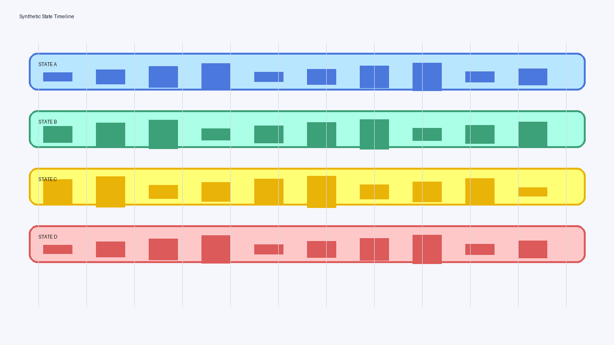
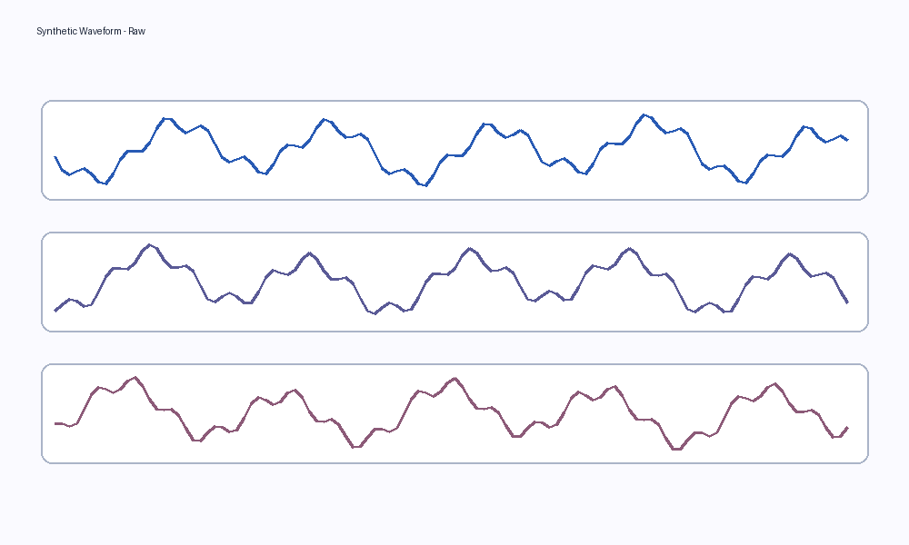
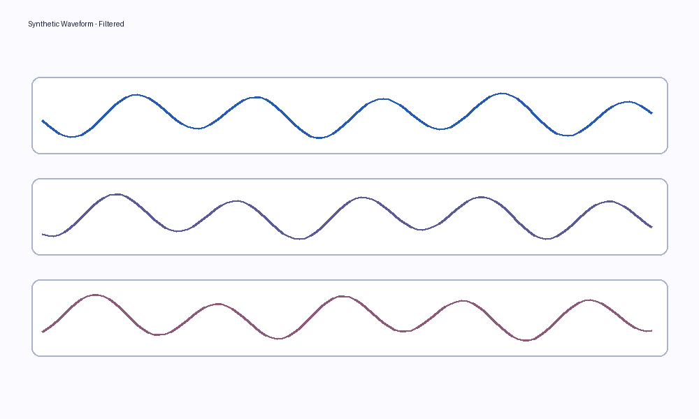
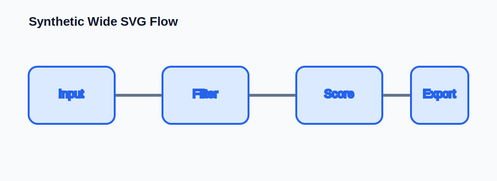
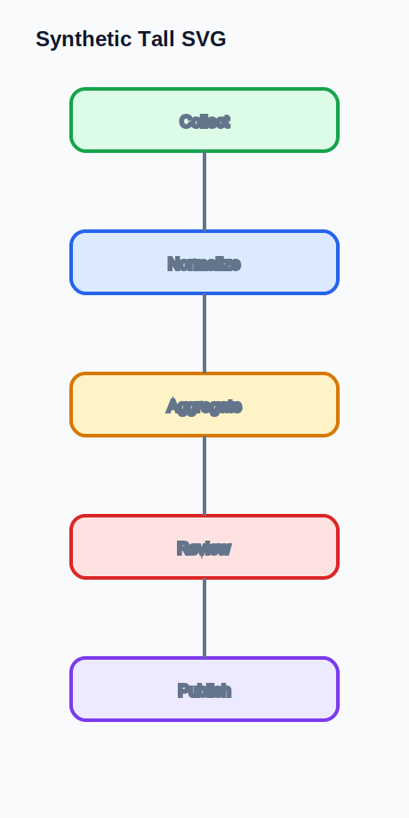
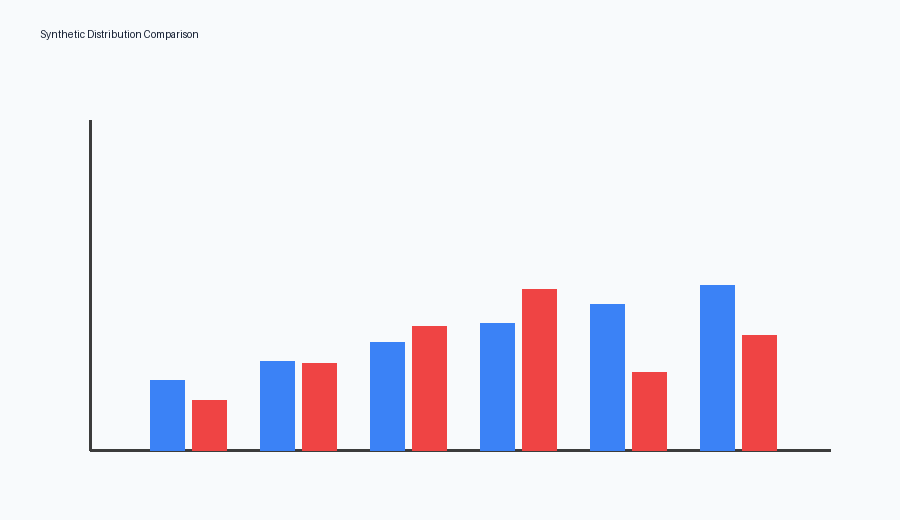
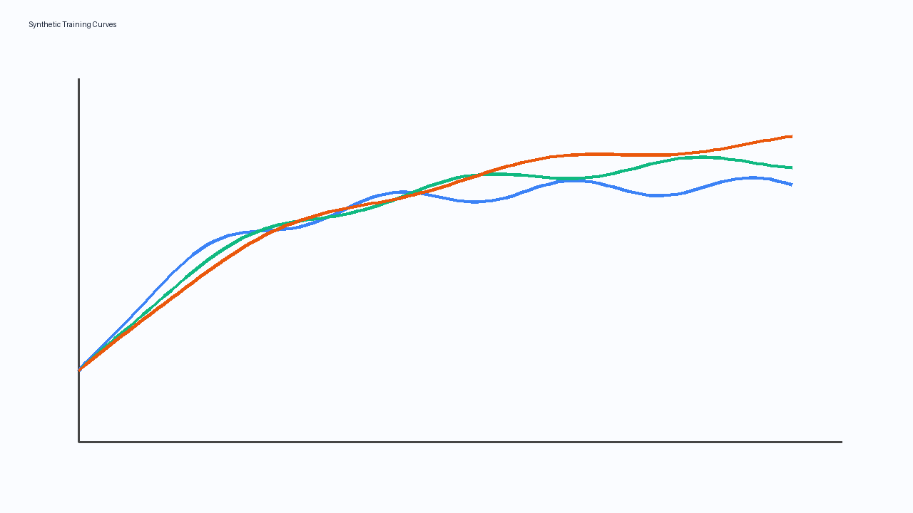
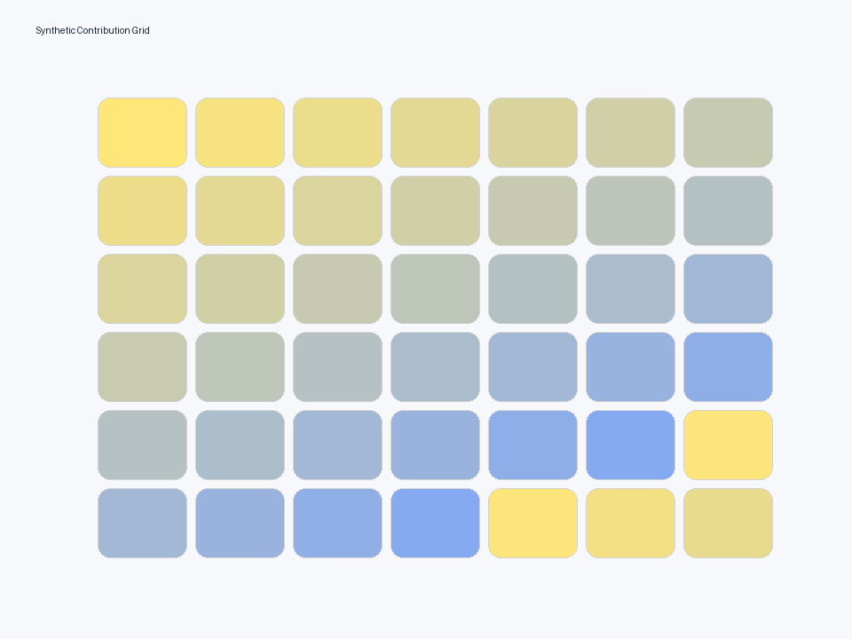
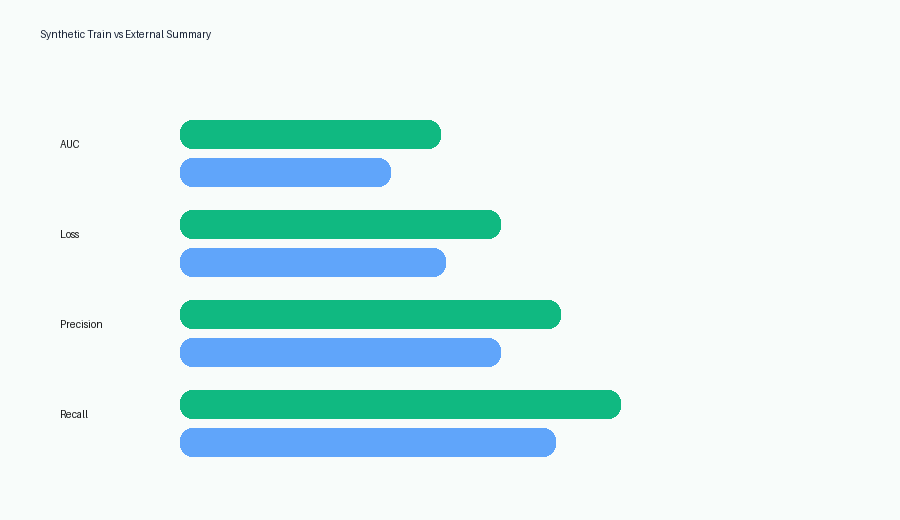
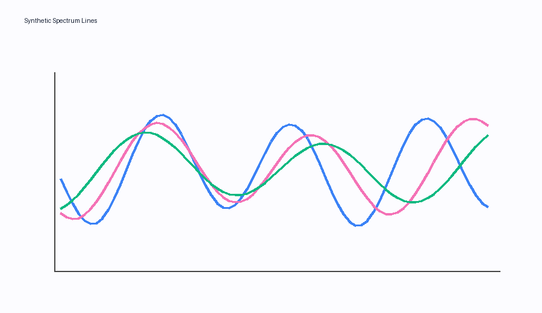

<!-- _class: lead -->
<!-- note: marpx Feature Showcase — comprehensive demo of all supported conversion features. Speaker notes are included to test the notes pane output in PPTX. -->

# marpx デモ — Feature Showcase
## Marp Markdown → 編集可能な PowerPoint

- Purpose: demonstrate every feature marpx converts natively
- Scope: native shapes, images, backgrounds, fallbacks, notes, and directives
- Rule: visual fidelity matters more than editability on this deck

<p class="muted">This file intentionally mixes ordinary layouts, edge cases, and unsupported content.</p>

---

## Typography And Inline Styles

This paragraph checks **bold**, *italic*, `inline code`, [links](https://example.com), and <u>underline via HTML</u>.

これは日本語の表示確認用サンプルです。English and 日本語 should coexist without broken spacing.

<p class="right">This line is right aligned by HTML.</p>
<p class="center serif">This centered line uses a serif family.</p>
<p class="mono tiny">Monospace tiny text: key=value, port=8080, mode=review.</p>

#### Heading Level Four
##### Heading Level Five
###### Heading Level Six

---

## Paragraph Flow And Wrapping

This slide intentionally uses multiple paragraphs with different lengths so a reviewer can check text box grouping, paragraph spacing, and line wrapping in a dense but ordinary layout.

The second paragraph is shorter. It should remain in the same visual region rather than drifting into a separate, oddly placed text box.

The third paragraph contains a forced<br>line break to verify that explicit HTML line breaks survive conversion.

---

## Lists And Nesting

- First bullet with ordinary text
- Second bullet with **emphasis** and a [link](https://example.com/docs)
  - Nested bullet level two
  - Another nested bullet level two
    - Nested bullet level three
- Third bullet closes the structure

1. First ordered item
2. Second ordered item
   1. Nested ordered item
   2. Another nested ordered item
3. Third ordered item

<ul class="checklist">
  <li>Checklist item rendered with pseudo content</li>
  <li>Another checklist item for visual comparison</li>
</ul>

---

## Quote And Decorated Containers

<div class="quote-box">

**Highlighted note for decoration testing**
- The first bullet should stay inside the decorated block
- The second bullet should preserve list level semantics
- **The final bullet should remain bold**

</div>

<div class="panel callout-list">
  <p>This neutral callout contains enough prose to test paragraph extraction.</p>
  <p>It should appear as two paragraphs inside a decorated shape.</p>
</div>

> This is a real Markdown blockquote.
> It should follow the native blockquote extraction path.
>
> The second paragraph checks paragraph breaks inside the same quote.

---

## Simple Table

| Column | Left aligned text | Numeric |
| --- | --- | ---: |
| Row A | Plain content | 12 |
| Row B | Content with **bold** text | 345 |
| Row C | Content with `code` | 6789 |
| Row D | Content with a [link](https://example.com) | 10 |

---

## Merged HTML Table

<table class="merge-table">
  <tr>
    <th>Group</th>
    <th>Variant</th>
    <th>Status</th>
    <th>Notes</th>
  </tr>
  <tr>
    <td rowspan="2">Merged Row</td>
    <td>Case A</td>
    <td>OK</td>
    <td>Checks rowspan handling.</td>
  </tr>
  <tr>
    <td>Case B</td>
    <td>OK</td>
    <td>Checks cell content after merge.</td>
  </tr>
  <tr>
    <td colspan="2">Merged Column</td>
    <td>Warn</td>
    <td>Checks colspan handling.</td>
  </tr>
</table>

---

## Code Blocks

```python
from dataclasses import dataclass

@dataclass
class Sample:
    name: str
    score: float

def normalize(value: float) -> float:
    return round(value / 100.0, 3)
```

Inline code should still look distinct: `uv run marpx input.md -o output.pptx`

---

## Two Column Layout

<div class="grid-2">
  <div class="card">
    <h3>Left Column</h3>
    <p>This side mixes heading, body text, and a short list.</p>
    <ul>
      <li>Layout should stay balanced</li>
      <li>Bullets should align to the text box</li>
    </ul>
  </div>
  <div class="card">
    <h3>Right Column</h3>
    <p>The right column uses a KPI and a short note.</p>
    <div class="kpi">97.4%</div>
    <p class="tiny">This value is arbitrary and only checks font sizing and spacing.</p>
  </div>
</div>

---

## PNG Images With Width Directives



<p class="tiny center">Check that the image appears, keeps its aspect ratio, and stays centered.</p>

---

## Side By Side PNG Images

<div class="compare-row">
  <figure>
    
    <figcaption>Image A with <code>object-fit: contain</code></figcaption>
  </figure>
  <figure>
    
    <figcaption>Image B with the same container size</figcaption>
  </figure>
</div>

---

## SVG Images

<div class="svg-pair">
  
  
</div>

<p class="tiny">Check that both SVG images render, preserve aspect ratio, and do not blur excessively.</p>

---

## Local Image Gallery

<div class="compare-row">
  <figure>
    
    <figcaption>Distribution style image</figcaption>
  </figure>
  <figure>
    
    <figcaption>Line chart style image</figcaption>
  </figure>
  <figure>
    
    <figcaption>Grid style image</figcaption>
  </figure>
</div>

---

## Background Color Only
<!-- _header: marpx デモ / Background Color -->
<!-- _footer: Solid background -->
<!-- _backgroundColor: #0f766e -->

<div class="grid-3">
  <div class="swatch" style="background:#1d4ed8;">Blue swatch</div>
  <div class="swatch" style="background:#0f766e;">Green swatch</div>
  <div class="swatch" style="background:#b91c1c;">Red swatch</div>
</div>

<p>This slide is useful for checking colored fills, rounded rectangles, and white text on dark backgrounds.</p>

---

## Background Image Default



<div class="panel">
  <h3>Default Background</h3>
  <p>This slide checks the plain <code>![bg]</code> path, which should behave like cover.</p>
</div>

---

## Background Image Cover


<div class="panel">
  <h3>Foreground Over Cover Background</h3>
  <p>Check text readability, z-order, and the crop behavior of the background image.</p>
</div>

---

## Background Image Contain


<div class="panel">
  <h3>Contain Background</h3>
  <p>The background should remain fully visible and centered rather than cropped.</p>
</div>

---

## Background Position Top Left


<div class="panel" style="background:rgba(255,255,255,0.88);">
  <h3>Anchored Cover Background</h3>
  <p>This slide should be reviewed with background position anchored toward the top-left corner.</p>
</div>

<!-- note: If needed, compare this with a version using top-left background position after HTML render. -->

---

## Background Image Split Right


### Split Background Right

- Content should stay on the left half.
- The background image should stay on the right half.
- Slide size should remain 16:9.

---

## Background Image Split Left


### Split Background Left

- Content should move to the right half.
- The background image should stay on the left half.
- This is a direct check of the advanced background split path.

---

## Multiple Background Images


### Layered Backgrounds

- The slide should keep both background images.
- Their order and split behavior should stay stable.
- Foreground text should remain readable.

---

## Image Scale Down And Position

<div class="compare-row">
  <figure>
    
    <figcaption><code>object-fit: scale-down</code> and <code>object-position: right center</code></figcaption>
  </figure>
  <figure>
    
    <figcaption><code>object-position: top left</code></figcaption>
  </figure>
</div>

---

## Split Style Layout Without Background Directive

<div class="grid-2">
  <div>
    <h3>Text Region</h3>
    <ul>
      <li>This slide simulates a split layout without changing slide size.</li>
      <li>Use it to compare ordinary text beside a large SVG.</li>
      <li>The image should stay on the right and keep its aspect ratio.</li>
    </ul>
  </div>
  <div class="panel center">
    
  </div>
</div>

---

## Directives And Pagination
<!-- _header: Directive Override -->
<!-- _footer: Footer override -->
<!-- _paginate: false -->

This slide overrides the header, footer, and paginate directives.

The expected behavior is:

- header text changes on this slide only
- footer text changes on this slide only
- page number is hidden on this slide

<!-- note: Speaker note for directive slide. Verify that this note appears in the PPTX notes pane. -->

---

## Directives Hidden
<!-- _header: "" -->
<!-- _footer: "" -->
<!-- _paginate: false -->

This slide should hide the header, footer, and page number entirely.

Use it to confirm that empty directive overrides remove generated text rather than leaving placeholders.

---

## Multi Paragraph Decorated Block

<aside class="quote-box">
This decorated aside uses ordinary placeholder prose and should become a decorated text shape.
It includes more than one sentence so the first paragraph wraps naturally.

Default mode is Example. Optional mode is Alternate.
</aside>

---

## Raw Inline SVG Fallback

<p>This slide contains inline SVG markup that should be rendered via fallback if native conversion is unavailable.</p>

<svg width="300" height="140" xmlns="http://www.w3.org/2000/svg">
  <rect x="10" y="10" width="280" height="120" rx="16" fill="#dbeafe" stroke="#1d4ed8" stroke-width="4"/>
  <circle cx="80" cy="70" r="28" fill="#1d4ed8"/>
  <text x="155" y="78" text-anchor="middle" font-size="26" fill="#0f172a">Inline SVG</text>
</svg>

---

## Full Slide Fallback Review Target

This slide is intended for optional review with `--fallback-mode slide`.

<svg width="1100" height="460" xmlns="http://www.w3.org/2000/svg">
  <rect x="10" y="10" width="1080" height="440" rx="32" fill="#eff6ff" stroke="#1d4ed8" stroke-width="8"/>
  <text x="550" y="110" text-anchor="middle" font-size="42" fill="#0f172a">Full Slide Fallback Candidate</text>
  <g fill="#1d4ed8">
    <circle cx="180" cy="220" r="36"/>
    <circle cx="340" cy="320" r="36"/>
    <circle cx="500" cy="220" r="36"/>
    <circle cx="660" cy="320" r="36"/>
    <circle cx="820" cy="220" r="36"/>
    <circle cx="980" cy="320" r="36"/>
  </g>
  <g stroke="#64748b" stroke-width="8">
    <line x1="180" y1="220" x2="340" y2="320"/>
    <line x1="340" y1="320" x2="500" y2="220"/>
    <line x1="500" y1="220" x2="660" y2="320"/>
    <line x1="660" y1="320" x2="820" y2="220"/>
    <line x1="820" y1="220" x2="980" y2="320"/>
  </g>
  <text x="550" y="450" text-anchor="middle" font-size="26" fill="#334155">This slide is useful when reviewing full-slide fallback behavior.</text>
</svg>

<!-- note: This slide should be reviewed in both default mode and --fallback-mode slide. -->

---

## Math And Mixed Text

<div class="math-box">
  <p>Math below may use a fallback path depending on the renderer:</p>
  <p>$$ f(x) = \int_{-\infty}^{\infty} e^{-t^2} \cos(xt)\,dt $$</p>
</div>

<p>Use this slide to check how unsupported structured content is captured.</p>

---

## RTL And Language Mix

<p class="rtl">هذا سطر عربي بسيط لاختبار الاتجاه من اليمين إلى اليسار.</p>

한국어 문장도 하나 넣어서 CJK 혼합 표시를 확인합니다.

Regular English text remains below for comparison.

---

## Dense Mixed Layout

<div class="grid-2">
  <div>
    <div class="card">
      <h3>Left Stack</h3>
      <p>A short paragraph sits above a small table.</p>
      <table>
        <tr><th>Key</th><th>Value</th></tr>
        <tr><td>alpha</td><td>12</td></tr>
        <tr><td>beta</td><td>34</td></tr>
      </table>
    </div>
  </div>
  <div>
    <div class="card">
      <h3>Right Stack</h3>
      <ul>
        <li>Bullet one</li>
        <li>Bullet two</li>
      </ul>
      
    </div>
  </div>
</div>

---

## Final Checklist

- Text stays editable where expected
- Tables remain native tables where possible
- Images and SVGs render with correct sizing
- Background images stay behind foreground content
- Notes, header, footer, and pagination behave as expected
- Fallback content appears instead of disappearing

<p class="tiny">If anything looks wrong, capture the slide number, what differs, and whether the issue is content loss or visual drift.</p>

<!-- note: Final reminder note. Testers can write feedback directly against slide numbers from this deck. -->
